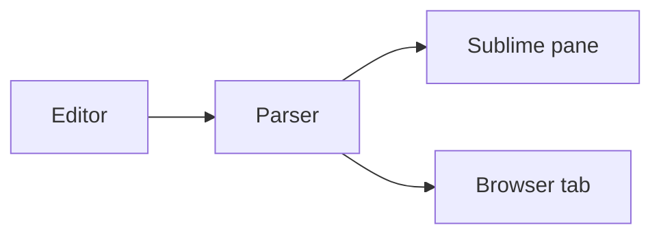

# Transfer notes

MarkdownX renders this file **as you type**. Prose, tables, and fenced code
appear in the Sublime pane. Diagrams and math are ==rendered in the browser==.

## Checklist

- [x] Parse the burn schedule
- [x] Highlight fenced code
- [ ] Chart the next transfer window

## Candidate transfers

| Maneuver    | Delta-v (m/s) | Status |
|:------------|--------------:|:------:|
| Hohmann     |         3,940 |  open  |
| Bi-elliptic |         3,720 | closed |
| Low-thrust  |         2,180 | study  |

## Speed at a point

```go
// visViva returns orbital speed at radius r on an orbit of semi-major axis a.
func visViva(mu, r, a float64) float64 {
	return math.Sqrt(mu * (2/r - 1/a))
}
```

## Pipeline



## The equations

Speed follows from $v = \sqrt{\mu\left(2/r - 1/a\right)}$, so a Hohmann
transfer between circular orbits costs

$$
\Delta v = \sqrt{\frac{\mu}{r_1}}\left(\sqrt{\frac{2 r_2}{r_1 + r_2}} - 1\right)
$$
