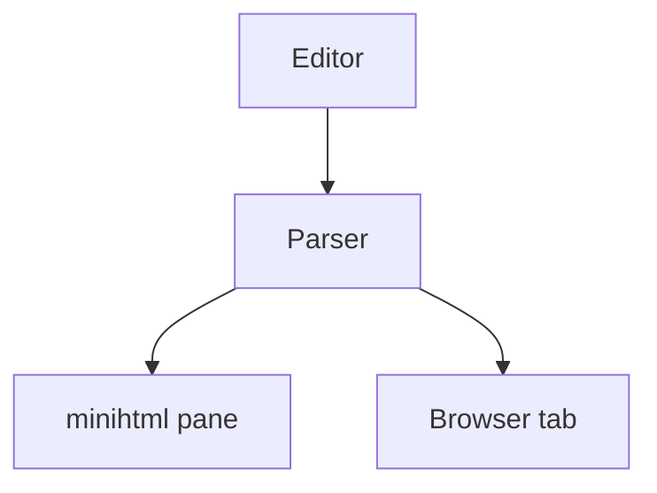

# Vellum kitchen sink

Every construct the preview is expected to handle, in one document. If something
regresses, it shows up here first.

## Inline formatting

Plain text with **bold**, *italic*, ***both***, `inline code`, ~~strikethrough~~,
==highlighted==, H~2~O and E=mc^2^. A [link](https://example.com), an autolink
https://example.com, and a footnote reference[^note].

Escaped prices should not become math: it cost $5 and then $6 more.
Real inline math does: the identity $e^{i\pi} + 1 = 0$ is famous.

[^note]: Footnotes collect at the bottom of the document.

## Headings

### Third level
#### Fourth level
##### Fifth level
###### Sixth level

## Lists

Tight unordered list:

- First item
- Second item with `code`
- Third item
  - Nested one
  - Nested two
    - Deeper still

Loose ordered list:

1. Set the thing up

   With a second paragraph inside the item.

2. Run it
3. Verify the output

Task list:

- [x] Parse GitHub tables
- [x] Highlight fenced code
- [ ] Render diagrams in the pane
- [ ] Ship it

## Tables

Left, right and centre alignment:

| Package  | Downloads | Status |
|:---------|----------:|:------:|
| vellum   |     1,204 |   ok   |
| mistune  |   980,000 |   ok   |
| minihtml |         0 |  n/a   |

A table with wide characters, which must stay aligned:

| Language | 名前     | Note              |
|:---------|:---------|:------------------|
| Japanese | 日本語   | Two cells wide    |
| Korean   | 한국어   | Also wide         |
| English  | English  | One cell per char |

A table with a very long cell, to exercise truncation:

| Key | Value |
|:----|:------|
| short | fine |
| long | this cell is deliberately far too long to fit inside any reasonable preview pane and must be truncated rather than allowed to wrap into an unreadable mess |

## Code

Go, with a comment and a string:

```go
package main

import "fmt"

func main() {
	for i := range 10 {
		fmt.Println(i + 1) // Go 1.22 range-over-int
	}
}
```

Ruby:

```ruby
class Greeter
  def initialize(name) = @name = name

  def call
    puts "hello, #{@name}"
  end
end
```

Crystal:

```crystal
struct Point
  getter x : Int32
  getter y : Int32

  def initialize(@x, @y); end
end
```

Python:

```python
def fib(n: int) -> list[int]:
    a, b = 0, 1
    out = []
    while a < n:
        out.append(a)
        a, b = b, a + b
    return out
```

JSON, JavaScript, and shell:

```json
{"name": "vellum", "version": "0.1.0", "private": true, "count": 42}
```

```js
const debounce = (fn, ms) => {
  let t;
  return (...args) => { clearTimeout(t); t = setTimeout(() => fn(...args), ms); };
};
```

```bash
find . -name '*.md' -print0 | xargs -0 grep -l 'TODO'
```

A diff:

```diff
- old line that went away
+ new line that replaced it
  unchanged context
```

A fence with no language:

```
plain preformatted text
    with indentation preserved
```

A fence in a language nothing knows:

```wubbalubba
dub dub {{ 42 }}
```

## Quotes

> A single-level quote.
>
> With a second paragraph, and some `code` in it.

> Nesting works too:
>
> > The inner quote.
> >
> > > And one deeper.

## Rules and breaks

Above the rule.

---

Below the rule.

## Definition list

Vellum
: A fine parchment made from calfskin.

minihtml
: Sublime Text's restricted HTML subset.

## Diagrams and math



Block math on its own lines:

$$
\int_0^\infty e^{-x^2} dx = \frac{\sqrt{\pi}}{2}
$$

Block math on a single line, which GitHub accepts:

$$E = mc^2$$

## Images

A local image that does not exist, to check the failure path:


## Raw HTML

<div align="center">
  <strong>Raw HTML block</strong>
</div>

## Long lines

This paragraph is a single very long line without any hard wrapping in the source, which exists to confirm that the preview wraps text at the pane edge rather than running off the side or forcing a horizontal scrollbar that minihtml cannot provide anyway.

AVeryLongUnbrokenTokenThatCannotBeWrappedAnywhereBecauseItContainsNoSpacesAtAllAndJustKeepsGoing
